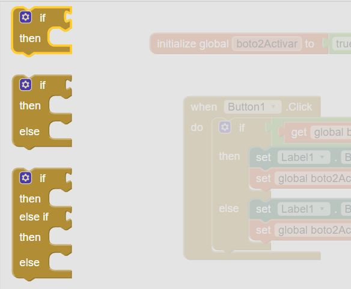
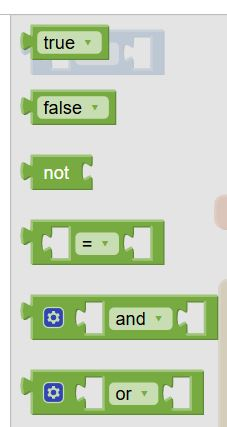
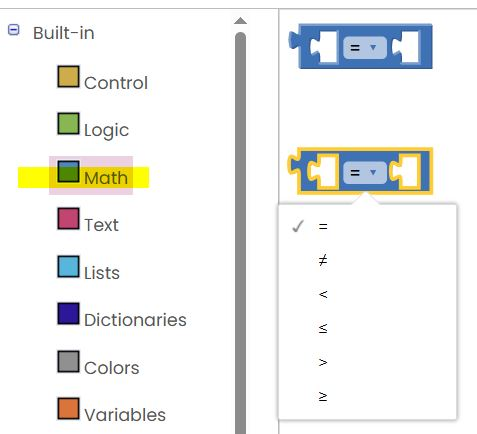
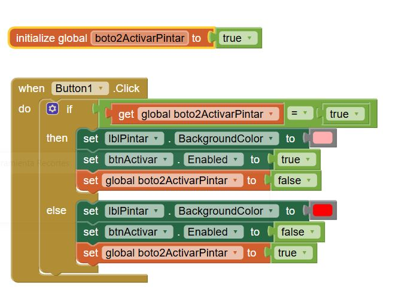

## Estructures Condicionals

Són estructures que permeten executar una part del codi (blocs) o una altra en funció de certes condicions lògiques.

  

Les condicions que s'uneixen a la part del `if` les trobem a l'apartat Built-in → Logic.

Bàsicament, són estructures que comparen una variable amb un valor o amb una altra variable.

Aquestes condicions retornen un valor **true** o **false**, després d’avaluar l'expressió.

A l'apartat **Math** hi ha altres blocs que permeten fer condicions lògiques com "menor que", "major que", "igual o major que"...

En aquest cas, tenim una variable que inicialment està a `true`, i quan arriba al `if` es comprova la condició amb l'operador d'igualtat (`=`). Com que la variable és `true` i la condició també ho és, s’executen les instruccions que hi ha dins el bloc `then`:

- El `Label` es pinta de color rosa  
- El `Botó2` es desactiva
- A més, en aquest cas, canviem el valor de la variable a `false`.

El segon cop que premem el botó, la condició ja no és certa (la variable val `false`), i per tant es realitza l’opció del `else`:
- que pinta el `Label` de color blau
- activa el botó.
- Tornar a activar la variable (true)

---

####  [Tornar](../Readme.md)

