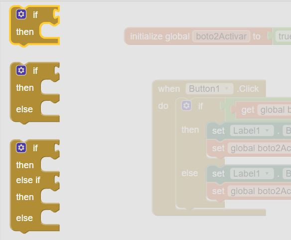
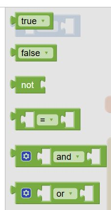
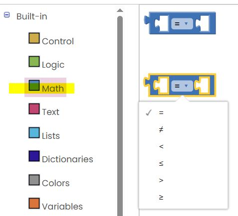
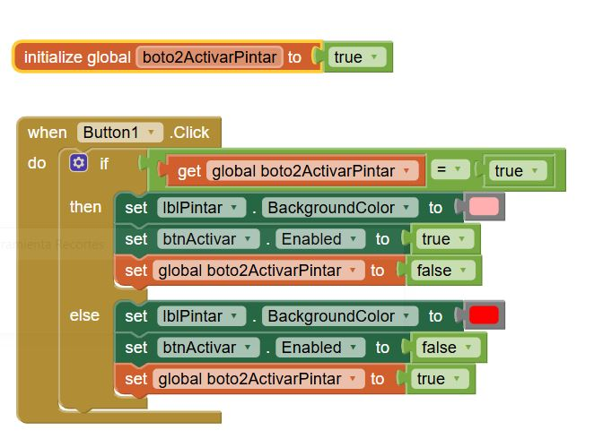

# SESSIÓ DOS

En aquesta sessió veurem el següent.

# Índex

- [Estructures condicionals](#estructures-condicionals)
- [App amb dues pantalles](#app-amb-dues-pantalles)
- [Activar i desactivar controls/visibles e invisibles](#desactivar)

## Estructures Condicionals

Són estructures que permeten executar una part del codi (blocs) o una altra en funció de certes condicions lògiques.

  

Les condicions que s'uneixen a la part del if, les trobem al apartat Built-in--> Logic

I basicament son estructures per comparar una variable amb un valor o amb un altra variable...

I son condicions que retornen un valor true/false, després d'evaluar l'expresió.

Al apartat Math hi ha un altre bloc que ens permet fer mes condicions logiques, menor, major que , igual o major... 

En aquest cas, tenim una variable que inicialment esta a true, i al arribar al if es valora la condició amb el operador de igualtat (=), com en aquest cas la variable es true i la condició que es pregunta es si es true, s'executa els codis que hi ha dins el then:

· El label es pinta de color rosa
· El boto2 es desactiva.

A més en aquest cas, canviem el valor de la variable a false.

El segon cop que apretarem el botó, la condició com ja val false, la condició no sera certa i es realitzarà la opció else, que pinta la label de blau, i activa el botó.
També tornem a canviar la variable a true.

## App amb dues pantalles
