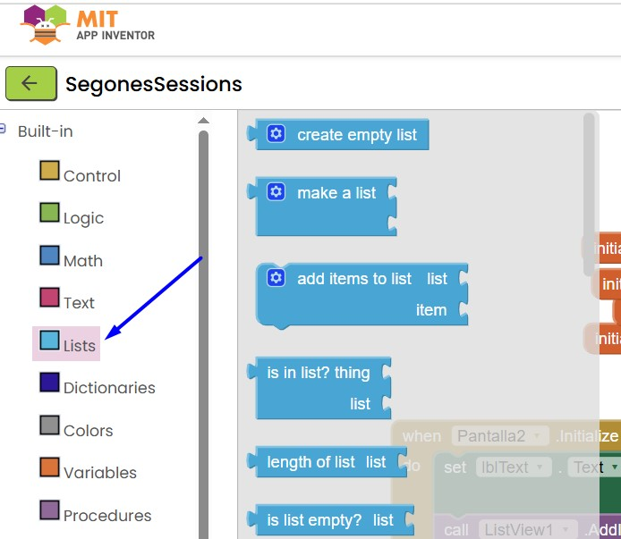
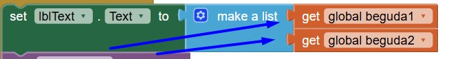

# Llistes

Un altre element important són les **llistes**. Les llistes serveixen per guardar múltiples valors junts, que es poden mostrar en un `Label` o en altres components més potents d’App Inventor.

Per mostrar una llista amb un component com el `ListView`, cal tenir aquest component a la pantalla. El `ListView` ens mostra tots els elements de la llista, un per un.

Un esdeveniment important del `ListView` és el **`AfterPicking`**, que serveix per saber quin element ha seleccionat l'usuari.

####  [Tornar](../Readme.md)
