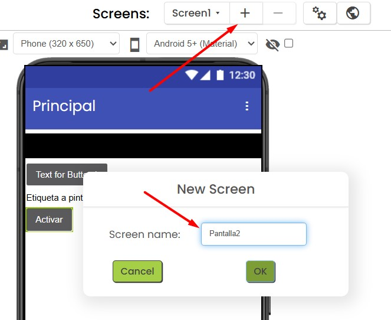
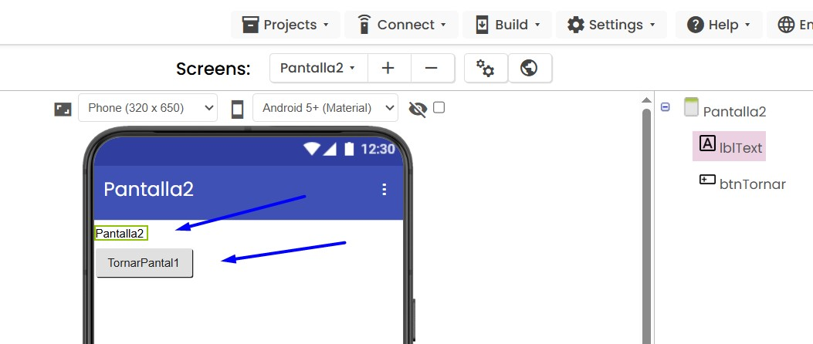
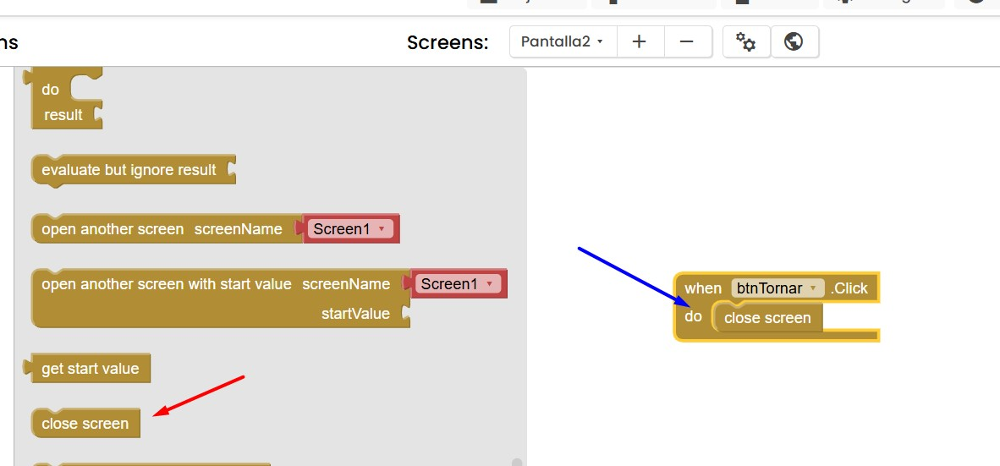
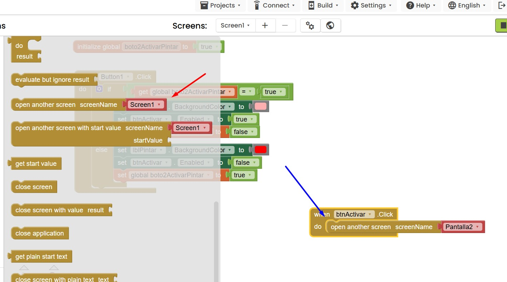

## App amb dues pantalles

En aquest apartat veurem com obrir una nova pantalla des de la pantalla principal.

Aprofitarem el codi d’[exemple](exempleif.JPG) anterior.

Farem que el segon botó, el que activàvem i desactivàvem, ens porti a una segona pantalla. I des d’aquesta, amb un altre botó, tanqui la pantalla i torni a la principal.

Primer de tot, a l’editor de blocs, crearem una nova pantalla anomenada **Pantalla2**.

A la `Pantalla2`, li afegirem una etiqueta i un botó.

Ara, als blocs d’aquesta pantalla, indicarem que quan es premi el botó, es tanqui la pantalla:

I als blocs de la pantalla principal, afegirem el codi per **obrir la nova pantalla**:

####  [Tornar](../Readme.md)
