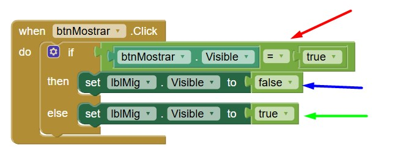

# Fer visible o invisible un component a App Inventor

En App Inventor, podem **amagar o mostrar components** com botons, imatges, etiquetes, etc. mitjançant la propietat **Visible**.

## Què és la propietat "Visible"?

És una propietat **booleana** dels components (és a dir, només pot ser **Cert** o **Fals**).

- Quan `Visible` és **true (cert)** ➜ el component es veu.
- Quan `Visible` és **false (fals)** ➜ el component s'amaga de la pantalla.

---

## 🎛Exemple bàsic

Imagina que tenim aquests components a la pantalla:

- Un **Botó**: `BotóMostrar`
- Una **Etiqueta**: `EtiquetaSecret`

Al començar, l'etiqueta està amagada.

### 🟢 Quan premem el botó, volem que aparegui l’etiqueta i el tornem a apretar desapareix.

### 🔷 Blocs de codi:

